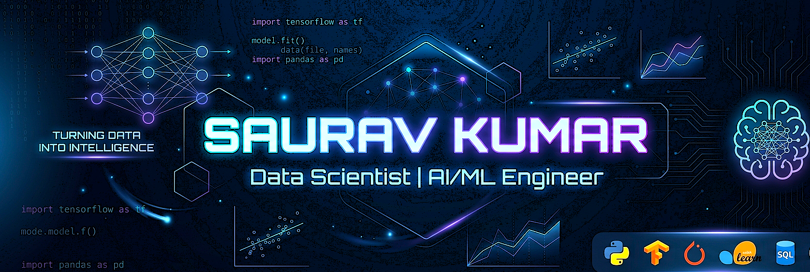

#                                    Hi 👋, I'm Saurav Kumar

  🚀 **Passionate about Data Science, AI/ML, and Building Real-World Intelligent Systems**

<table>
<tr>

<td width="40%">
  
</td>

<td width="60%">

### 🎓 About Me
- 🎓 B.Tech Computer Science student  
- 🤖 Data Science & AI/ML Enthusiast  
- 🧠 Working on ML & Deep Learning Projects  
- 📊 Love turning data into meaningful insights  
- ⚡ Interested in AI Agents & Automation  
- 🌱 Learning Advanced ML, MLOps & System Design  

</td>

</tr>
</table>
  
### 🛠️ Tech Stack

### 📊 GitHub Stats

---

### 📈 GitHub Activity Graph

---

### 🔥 Featured Projects

* 🤖 AI/ML Projects
* 📊 Data Analysis Dashboards
* 🧠 Deep Learning Models
* ⚙️ Automation & Intelligent Systems

---

### 🌐 Connect with Me

---

### ✨ Signature

> *"Turning data into intelligence — building systems that learn, adapt, and evolve."*

